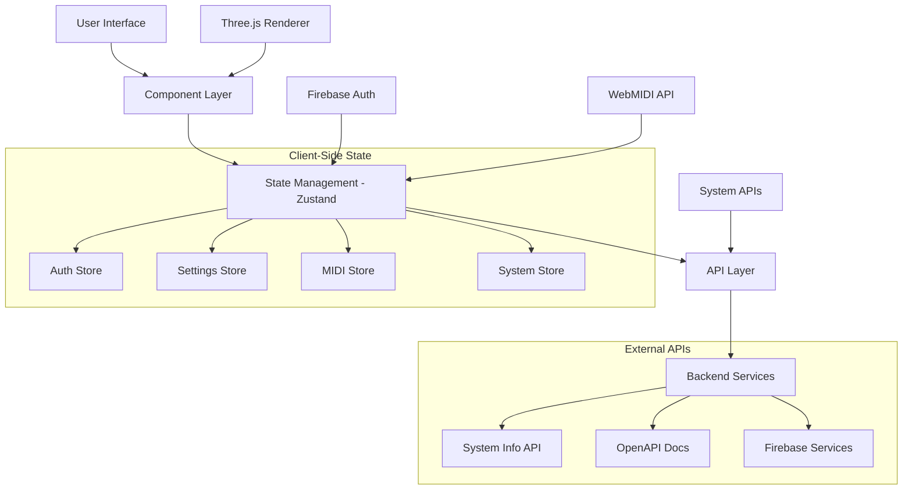
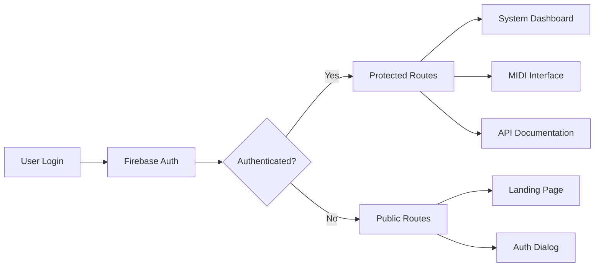

# 🚀 Minux.io - Modular OS Web Interface

> **Spec-Driven Development Platform for Agent Automation**  
> Next-generation web interface with real-time system monitoring, 3D visualization, MIDI composition, and AI-driven automation hooks.

[](https://web.minux.io)
[](https://www.typescriptlang.org/)
[](https://nextjs.org/)
[](LICENSE)

## 🎯 Overview

Minux.io is a **spec-driven development platform** designed for **agent automation**. This web interface serves as the primary dashboard for the Minux modular operating system, featuring advanced 3D visualization, real-time system monitoring, MIDI composition tools, and comprehensive API documentation. Built with modern web technologies and designed for seamless agent integration.

## ✨ Core Features

### 🏗️ **Architecture & Infrastructure**
- **Next.js 15.3** with App Router and SSR optimization
- **TypeScript 5.0** with strict type checking and comprehensive interfaces
- **Firebase Authentication** with email/password and OAuth integration
- **Zustand** state management with persistent storage
- **Three.js & React Three Fiber** for 3D visualization and WebGL rendering
- **Tailwind CSS** with custom design system and responsive layouts
- **Swagger/OpenAPI** documentation with live API testing

### 🎨 **User Interface & Experience**
- **Responsive Design** optimized for desktop, tablet, and mobile
- **Dark Theme** with custom accent colors and accessibility features
- **3D Background** with interactive particle systems and WebGL effects
- **Draggable Windows** for multi-task workflow management
- **Real-time Notifications** with toast system and error handling
- **Progressive Loading** with suspense boundaries and skeleton states

### 🎹 **MIDI & Music Composition**
- **3D Virtual Piano** with realistic key physics and visual feedback
- **MIDI Device Integration** supporting WebMIDI API and hardware controllers
- **Classical Music Player** featuring Mozart compositions with note visualization
- **Practice Modes** including scales, chords, intervals, and sight-reading
- **Real-time Staff Notation** with treble/bass clef display and note tracking
- **Exercise Systems** with guided learning and progress tracking

### 📊 **System Monitoring & Management**
- **Real-time Metrics** for CPU, memory, network, and storage usage
- **Process Management** with detailed process monitoring and control
- **Network Statistics** including interface monitoring and bandwidth tracking
- **Security Dashboard** with firewall status and threat detection
- **Performance Analytics** with historical data and trend analysis
- **Storage Management** with STL file explorer and space monitoring

### 🔌 **API & Integration**
- **RESTful API** with comprehensive system information endpoints
- **OpenAPI 3.0 Specification** with interactive documentation
- **Real-time WebSocket** connections for live data streaming
- **Modular Architecture** supporting plugin-based extensions
- **Agent Hooks** for automated testing, documentation, and optimization
- **Cross-platform Compatibility** with Linux, macOS, and Windows support

## 🛠️ Prerequisites

Before you begin, ensure you have the following installed on your system:

- **Node.js** (version 20 or higher) - [Download from nodejs.org](https://nodejs.org/)
- **npm** (comes with Node.js) or your preferred package manager (yarn, pnpm, or bun)
- **Git** - [Download from git-scm.com](https://git-scm.com/)

You can verify your installations by running:
```bash
node --version
npm --version
git --version
```

## 🚀 Quick Start

### 1. **Clone the Repository**
```bash
git clone https://github.com/hectorMiranda/web.minux.io.git
cd web.minux.io
```

### 2. **Install Dependencies**
```bash
npm install
# or
yarn install
# or
pnpm install
# or
bun install
```

### 3. **Firebase Authentication Setup**

**a. Create a Firebase Project:**
- Go to [Firebase Console](https://console.firebase.google.com/)
- Click "Create a project" and follow the setup wizard
- Enable Firebase Authentication in your project
- Configure sign-in methods (Email/Password is recommended)

**b. Get Firebase Configuration:**
- In Firebase Console, go to Project Settings > General
- Scroll down to "Your apps" and click "Add app" (Web icon)
- Register your app and copy the Firebase config object

**c. Configure Environment Variables:**
- Copy `.env.example` to `.env.local`: `cp .env.example .env.local`
- Edit `.env.local` and add your Firebase configuration:
```env
NEXT_PUBLIC_FIREBASE_API_KEY=your_api_key_here
NEXT_PUBLIC_FIREBASE_AUTH_DOMAIN=your_project_id.firebaseapp.com
NEXT_PUBLIC_FIREBASE_PROJECT_ID=your_project_id
NEXT_PUBLIC_FIREBASE_STORAGE_BUCKET=your_project_id.appspot.com
NEXT_PUBLIC_FIREBASE_MESSAGING_SENDER_ID=your_sender_id
NEXT_PUBLIC_FIREBASE_APP_ID=your_app_id
```

**Note:** The application requires Firebase Authentication to access protected features. Without proper configuration, authentication will not work.

### 4. **Start the Development Server**
```bash
npm run dev
# or
yarn dev
# or
pnpm dev
# or
bun dev
```

Open [http://localhost:3000](http://localhost:3000) with your browser to see the result.

## 📁 Project Structure

```
web.minux.io/
├── 📂 public/                    # Static assets and icons
├── 📂 src/
│   ├── 📂 app/                   # Next.js App Router
│   │   ├── 📂 (authenticated)/  # Protected routes requiring authentication
│   │   │   ├── 📂 api-docs/      # Swagger API documentation
│   │   │   ├── 📂 blockchain/    # Blockchain monitoring dashboard
│   │   │   ├── 📂 console/       # System console interface
│   │   │   ├── 📂 dashboard/     # Main dashboard overview
│   │   │   ├── 📂 midi/          # MIDI composition and piano interface
│   │   │   ├── 📂 network/       # Network monitoring and configuration
│   │   │   ├── 📂 performance/   # Performance analytics and metrics
│   │   │   ├── 📂 power/         # Power management and battery status
│   │   │   ├── 📂 security/      # Security dashboard and firewall
│   │   │   ├── 📂 sensors/       # Hardware sensors and temperature monitoring
│   │   │   ├── 📂 settings/      # Application settings and preferences
│   │   │   ├── 📂 stl-explorer/  # 3D model file explorer and viewer
│   │   │   ├── 📂 storage/       # Storage management and disk analysis
│   │   │   ├── 📂 system/        # System overview and process management
│   │   │   ├── 📂 test-mobile/   # Mobile device testing interface
│   │   │   └── 📂 wifi/          # Wi-Fi configuration and diagnostics
│   │   ├── 📂 (public)/          # Public routes (landing page, auth)
│   │   ├── 📂 api/               # API routes and endpoints
│   │   │   ├── 📂 docs/          # OpenAPI documentation endpoint
│   │   │   └── 📂 system-info/   # System information API
│   │   ├── 📄 favicon.ico        # Application favicon
│   │   ├── 📄 globals.css        # Global styles and CSS variables
│   │   ├── 📄 layout.tsx         # Root layout component
│   │   └── 📄 providers.tsx      # Global providers (Auth, Theme, Toast)
│   ├── 📂 components/            # Reusable React components
│   │   ├── 📂 auth/              # Authentication components
│   │   │   ├── 📄 AuthCube.tsx           # 3D authentication cube animation
│   │   │   ├── 📄 AuthProvider.tsx       # Authentication context provider
│   │   │   ├── 📄 FirebaseAuthDialog.tsx # Firebase auth modal dialog
│   │   │   └── 📄 PasswordDialog.tsx     # Password input dialog
│   │   ├── 📂 dashboard/         # Dashboard-specific components
│   │   ├── 📂 layout/            # Layout and navigation components
│   │   │   ├── 📄 AppLayout.tsx         # Main application layout
│   │   │   ├── 📄 MobileNavigation.tsx  # Mobile navigation menu
│   │   │   ├── 📄 Sidebar.tsx           # Desktop sidebar navigation
│   │   │   ├── 📄 TopBar.tsx            # Top navigation bar
│   │   │   └── 📄 TopNav.tsx            # Top navigation component
│   │   ├── 📂 midi/              # MIDI and music composition components
│   │   │   ├── 📂 refactored/    # Improved MIDI components
│   │   │   │   ├── 📄 MIDIKeyboard.tsx  # 3D virtual piano with Three.js
│   │   │   │   ├── 📄 MIDIToolbar.tsx   # MIDI device selection and controls
│   │   │   │   ├── 📄 DebugConsole.tsx  # MIDI debugging and logging
│   │   │   │   └── 📄 types.ts          # MIDI-related TypeScript types
│   │   │   ├── 📄 GrandStaff.tsx        # Musical staff notation renderer
│   │   │   ├── 📄 Keyboard3D.tsx        # 3D keyboard wrapper component
│   │   │   ├── 📄 KeyboardRenderer.tsx  # WebGL keyboard renderer
│   │   │   ├── 📄 ThreeScene.tsx        # Three.js scene setup
│   │   │   └── 📄 MIDIKeyboard.tsx      # Legacy MIDI keyboard component
│   │   ├── 📂 storage/           # Storage and file management components
│   │   ├── 📂 ui/                # UI primitives and design system
│   │   ├── 📄 Background3D.tsx           # 3D animated background
│   │   ├── 📄 LoadingAnimation.tsx       # Loading states and spinners
│   │   ├── 📄 SwaggerUIWrapper.tsx       # Swagger UI integration
│   │   ├── 📄 ThreeProvider.tsx          # Three.js context provider
│   │   └── 📄 ...                        # Additional utility components
│   ├── 📂 config/                # Configuration files
│   │   └── 📄 minux.config.ts            # Site configuration and settings
│   ├── 📂 data/                  # Static data and content
│   │   └── 📄 mozartPieces.ts            # Classical music compositions data
│   ├── 📂 hooks/                 # Custom React hooks
│   │   ├── 📄 useLocalStorage.ts         # localStorage state management
│   │   ├── 📄 useMIDITiming.ts           # MIDI timing and synchronization
│   │   ├── 📄 useScreenSize.ts           # Responsive design utilities
│   │   └── 📄 useSystemInfo.ts           # System information fetching
│   ├── 📂 lib/                   # Utility libraries and configurations
│   │   ├── 📄 auth.ts                    # Zustand authentication store
│   │   ├── 📄 firebase.ts                # Firebase configuration (server)
│   │   ├── 📄 firebase-client.ts         # Firebase configuration (client)
│   │   ├── 📄 settings.ts                # Application settings store
│   │   ├── 📄 swagger.ts                 # OpenAPI documentation configuration
│   │   ├── 📄 theme.ts                   # Theme and styling utilities
│   │   └── 📄 utils.ts                   # General utility functions
│   └── 📂 types/                 # TypeScript type definitions
│       ├── 📄 gsap.d.ts                  # GSAP animation library types
│       ├── 📄 react-three-drei.d.ts      # React Three Drei types
│       ├── 📄 react-three-fiber.d.ts     # React Three Fiber types
│       └── 📄 webmidi.d.ts               # WebMIDI API types
├── 📄 next.config.js             # Next.js configuration
├── 📄 tailwind.config.js         # Tailwind CSS configuration
├── 📄 tsconfig.json              # TypeScript configuration
├── 📄 package.json               # Dependencies and scripts
└── 📄 README.md                  # This file
```

## 📋 Available Scripts

| Script | Description | Usage |
|--------|-------------|-------|
| `npm run dev` | Runs the app in development mode with hot reload | Development |
| `npm run build` | Builds the app for production with optimizations | Deployment |
| `npm run start` | Runs the built app in production mode | Production |
| `npm run lint` | Runs ESLint to check for code issues | Code Quality |
| `npm run lint:strict` | Runs strict ESLint checks with all rules | CI/CD |
| `npm run check` | Runs TypeScript type checking and linting | Pre-commit |
| `npm run precommit` | Pre-commit hook for code validation | Git Hooks |

## 🏗️ Architecture Overview

### 🔧 **Technology Stack**

| Category | Technology | Version | Purpose |
|----------|------------|---------|---------|
| **Framework** | Next.js | 15.3 | React framework with SSR and App Router |
| **Language** | TypeScript | 5.0 | Static type checking and enhanced IDE support |
| **Authentication** | Firebase | 10.14 | User authentication and session management |
| **State Management** | Zustand | 5.0 | Lightweight state management with persistence |
| **3D Graphics** | Three.js | 0.161 | WebGL rendering and 3D visualization |
| **3D React** | React Three Fiber | 8.15 | React bindings for Three.js |
| **Styling** | Tailwind CSS | 3.4 | Utility-first CSS framework |
| **Animation** | Framer Motion | 12.7 | Declarative animations and gestures |
| **Animation (Advanced)** | GSAP | 3.12 | High-performance animations |
| **MIDI** | WebMIDI | 2.5 | MIDI device integration and music composition |
| **API Documentation** | Swagger | - | OpenAPI 3.0 specification and interactive docs |
| **Icons** | Lucide React | 0.506 | Consistent icon library |
| **Notifications** | Sonner | 2.0 | Toast notifications and alerts |

### 🎯 **Core Architecture Principles**

1. **Spec-Driven Development**: Every component and API follows OpenAPI specifications
2. **Agent-Ready Automation**: Built-in hooks for automated testing, documentation, and optimization
3. **Modular Design**: Loosely coupled components with clear interfaces
4. **Type Safety**: Comprehensive TypeScript coverage with strict mode enabled
5. **Performance First**: Optimized rendering with suspense boundaries and code splitting
6. **Accessibility**: WCAG 2.1 compliant with semantic HTML and ARIA labels

### 🔀 **Data Flow Architecture**



### 🛡️ **Security & Authentication**



## 🎹 MIDI System Specifications

### **MIDI Keyboard Component Architecture**

```typescript
interface MIDIKeyboardProps {
  selectedOutput: WebMidi.MIDIOutput | null;
  onNoteOn: (note: number, velocity: number) => void;
  onNoteOff: (note: number) => void;
  activeNotes?: Set<number>;
  showDebug?: boolean;
  exerciseMode?: PracticeMode;
  expectedNotes?: number[];
}

interface SystemMetrics {
  cpuUsage: number;
  cpuSpeed: number;
  cpuCores: number;
  memoryUsed: number;
  memoryTotal: number;
  networkSpeed: number;
  networkLatency: number;
}
```

### **3D Visualization Features**

- **Real-time Key Physics**: Pressure-sensitive key depression with realistic animation
- **Note Visualization**: Color-coded notes with musical staff integration
- **Multiple Camera Views**: Perspective, top-down, and side camera angles
- **Interactive Controls**: Orbit controls with zoom and pan limitations
- **Practice Modes**: Scales, chords, intervals, and sight-reading exercises
- **Classical Music Player**: Mozart compositions with synchronized visual feedback

### **MIDI Device Integration**

```typescript
// WebMIDI API Integration
navigator.requestMIDIAccess().then((midiAccess) => {
  const outputs = Array.from(midiAccess.outputs.values());
  const inputs = Array.from(midiAccess.inputs.values());
  
  // Handle MIDI input
  inputs.forEach(input => {
    input.onmidimessage = (message) => {
      const [command, note, velocity] = message.data;
      handleMIDIMessage(command, note, velocity);
    };
  });
});
```

## 📊 System Monitoring API

### **System Information Endpoint**

```yaml
/api/system-info:
  get:
    summary: Get comprehensive system information
    responses:
      200:
        description: System information retrieved successfully
        content:
          application/json:
            schema:
              type: object
              properties:
                platform:
                  type: string
                  example: "darwin"
                arch:
                  type: string
                  example: "x64"
                hostname:
                  type: string
                  example: "MacBook-Pro"
                cpus:
                  type: array
                  items:
                    type: object
                cpuUsage:
                  type: number
                  example: 12.5
                totalMemory:
                  type: number
                  example: 17179869184
                freeMemory:
                  type: number
                  example: 8589934592
                network:
                  type: object
                  properties:
                    speed:
                      type: string
                      example: "0.25"
                    latency:
                      type: number
                      example: 0
```

### **Real-time Metrics Collection**

```typescript
// System metrics fetching with error handling
const fetchSystemMetrics = async (): Promise<SystemMetrics> => {
  try {
    const [latency, response] = await Promise.all([
      measureLatency(),
      fetch('/api/system-info')
    ]);
    
    const data = await response.json();
    
    return {
      cpuUsage: Math.round(data.cpuUsage),
      cpuSpeed: data.cpus[0]?.speed / 1000 || 0,
      cpuCores: data.cpus.length,
      memoryUsed: Math.round((data.totalMemory - data.freeMemory) / (1024 ** 3)),
      memoryTotal: Math.round(data.totalMemory / (1024 ** 3)),
      networkSpeed: parseFloat(data.network.speed),
      networkLatency: latency
    };
  } catch (error) {
    console.error('Failed to fetch system metrics:', error);
    throw error;
  }
};
```

## 🤖 Agent Automation Hooks

### **Automated Testing Framework**

```typescript
// Example: Automated component testing
interface AgentTestHook {
  component: string;
  testSuite: string[];
  automation: {
    unit: boolean;
    integration: boolean;
    e2e: boolean;
  };
}

// Agent-driven test generation
const generateTests = (component: string): AgentTestHook => ({
  component,
  testSuite: [
    'renders correctly',
    'handles user interaction',
    'manages state properly',
    'integrates with APIs'
  ],
  automation: {
    unit: true,
    integration: true,
    e2e: true
  }
});
```

### **Documentation Generation**

```typescript
// Automatic API documentation generation
interface APIDocumentationHook {
  endpoint: string;
  method: string;
  parameters: Parameter[];
  responses: Response[];
  examples: Example[];
}

// Agent hook for Swagger generation
export const generateAPIDoc = (route: string): APIDocumentationHook => {
  // Auto-generate documentation from TypeScript interfaces
  return parseRouteDefinition(route);
};
```

### **Performance Optimization**

```typescript
// Agent-driven performance monitoring
interface PerformanceHook {
  component: string;
  metrics: {
    renderTime: number;
    memoryUsage: number;
    bundleSize: number;
  };
  optimizations: string[];
}

// Automated performance optimization suggestions
export const analyzePerformance = (component: string): PerformanceHook => {
  return {
    component,
    metrics: measureComponentPerformance(component),
    optimizations: generateOptimizationSuggestions(component)
  };
};
```

## 🔧 Development Workflow

### **Code Quality Standards**

```bash
# Pre-commit hooks
npm run check                 # TypeScript + ESLint validation
npm run lint:strict          # Strict linting rules
npm run test                 # Automated test suite
npm run build                # Production build validation
```

### **Agent Integration Points**

1. **Component Analysis**: Automated component complexity analysis
2. **API Validation**: Automatic OpenAPI spec validation
3. **Performance Monitoring**: Real-time performance tracking
4. **Security Scanning**: Automated security vulnerability detection
5. **Dependency Management**: Automated dependency updates and conflict resolution

### **Continuous Integration Pipeline**

```yaml
# .github/workflows/agent-automation.yml
name: Agent Automation Pipeline
on: [push, pull_request]
jobs:
  quality-check:
    runs-on: ubuntu-latest
    steps:
      - uses: actions/checkout@v3
      - name: Setup Node.js
        uses: actions/setup-node@v3
        with:
          node-version: '20'
      - name: Install dependencies
        run: npm ci
      - name: Run agent quality checks
        run: |
          npm run check
          npm run lint:strict
          npm run test
          npm run build
```

## 🐛 Troubleshooting Guide

### **Common Issues & Solutions**

| Issue | Symptoms | Solution |
|-------|----------|----------|
| **Port Conflict** | `EADDRINUSE: address already in use :::3000` | Next.js auto-selects next available port |
| **Node Version** | Build errors, package incompatibilities | Upgrade to Node.js 20+ (`node --version`) |
| **Dependencies** | Installation failures, module not found | Delete `node_modules` & `package-lock.json`, run `npm install` |
| **TypeScript Errors** | Build failures, type mismatches | Run `npm run check` for detailed error reports |
| **Firebase Auth** | Authentication not working | Verify `.env.local` configuration and Firebase console settings |
| **MIDI Issues** | No MIDI devices detected | Check browser MIDI permissions and hardware connections |
| **3D Performance** | Low FPS, rendering issues | Enable hardware acceleration in browser settings |
| **Build Errors** | Production build failures | Check for TypeScript errors and missing environment variables |

### **Performance Optimization Tips**

1. **Hardware Acceleration**: Ensure GPU acceleration is enabled for WebGL
2. **Memory Management**: Monitor memory usage in browser dev tools
3. **Network Optimization**: Use browser caching and compression
4. **Bundle Analysis**: Run `npm run build` to analyze bundle sizes
5. **3D Optimization**: Limit polygon count and use efficient materials

### **Development Environment Setup**

```bash
# Recommended VS Code extensions
code --install-extension ms-vscode.vscode-typescript-next
code --install-extension bradlc.vscode-tailwindcss
code --install-extension esbenp.prettier-vscode
code --install-extension ms-vscode.vscode-eslint

# Chrome extensions for development
# - React Developer Tools
# - Redux DevTools
# - Web MIDI API
```

## 🌐 Deployment

### **Vercel Deployment (Recommended)**

```bash
# Install Vercel CLI
npm i -g vercel

# Deploy to Vercel
vercel --prod

# Configure environment variables in Vercel dashboard
# - NEXT_PUBLIC_FIREBASE_API_KEY
# - NEXT_PUBLIC_FIREBASE_AUTH_DOMAIN
# - NEXT_PUBLIC_FIREBASE_PROJECT_ID
# - NEXT_PUBLIC_FIREBASE_STORAGE_BUCKET
# - NEXT_PUBLIC_FIREBASE_MESSAGING_SENDER_ID
# - NEXT_PUBLIC_FIREBASE_APP_ID
```

### **Docker Deployment**

```dockerfile
FROM node:20-alpine AS builder
WORKDIR /app
COPY package*.json ./
RUN npm ci --only=production

FROM node:20-alpine AS runner
WORKDIR /app
COPY --from=builder /app/node_modules ./node_modules
COPY . .
RUN npm run build

EXPOSE 3000
CMD ["npm", "start"]
```

### **Production Environment Variables**

```env
# Production .env.local
NODE_ENV=production
NEXT_PUBLIC_FIREBASE_API_KEY=prod_api_key
NEXT_PUBLIC_FIREBASE_AUTH_DOMAIN=prod_domain
NEXT_PUBLIC_FIREBASE_PROJECT_ID=prod_project_id
NEXT_PUBLIC_FIREBASE_STORAGE_BUCKET=prod_bucket
NEXT_PUBLIC_FIREBASE_MESSAGING_SENDER_ID=prod_sender_id
NEXT_PUBLIC_FIREBASE_APP_ID=prod_app_id
```

## 📚 API Documentation

### **Interactive API Explorer**

Visit `/api-docs` (requires authentication) to access the interactive Swagger UI with:

- **Live API Testing**: Execute API calls directly from the browser
- **Request/Response Examples**: See real data formats and structures
- **Authentication Integration**: Test APIs with your current session
- **Schema Validation**: Automatic request/response validation

### **OpenAPI Specification**

```yaml
openapi: 3.0.0
info:
  title: Minux.io API Documentation
  version: 1.0.0
  description: API documentation for Minux.io platform
  contact:
    name: Minux.io Support
    url: https://minux.io
    email: support@minux.io
servers:
  - url: https://web.minux.io
    description: Production server
  - url: http://localhost:3000
    description: Development server
```

## 🤝 Contributing

### **Development Guidelines**

1. **Fork & Clone**: Create your feature branch from `main`
2. **Code Standards**: Follow TypeScript and ESLint configurations
3. **Testing**: Write tests for new components and API endpoints
4. **Documentation**: Update relevant documentation and type definitions
5. **Pull Request**: Submit PR with detailed description and test results

### **Agent-Driven Development**

- Use the built-in agent hooks for automated testing and documentation
- Follow spec-driven development principles for all new features
- Ensure OpenAPI specifications are updated for API changes
- Leverage automation tools for code quality and performance optimization

## 📄 License

This project is licensed under the MIT License - see the [LICENSE](LICENSE) file for details.

## 🙏 Acknowledgments

- [Next.js](https://nextjs.org) - React framework with excellent developer experience
- [Three.js](https://threejs.org) - 3D graphics library for WebGL rendering
- [Firebase](https://firebase.google.com) - Authentication and backend services
- [Tailwind CSS](https://tailwindcss.com) - Utility-first CSS framework
- [Vercel](https://vercel.com) - Platform for deploying and hosting

---

**Built with ❤️ by the Minux.io team**  
*For questions or support, visit [minux.io](https://minux.io) or contact support@minux.io*
